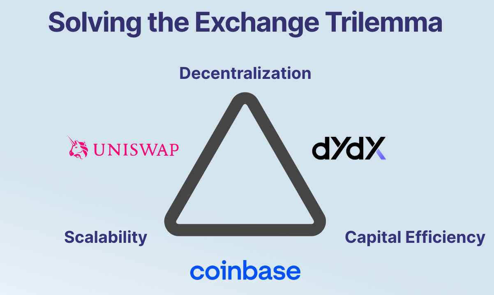

# About Sei

## What is Sei?

Sei is a general purpose, open-source Layer 1 blockchain specialized for the exchange of digital assets. Leveraging a novel consensus and technical breakthroughs, Sei is the fastest blockchain in the industry.&#x20;

A common misconception is that Sei is a DeFi chain. However, the exchange of digital assets is universal across gaming, social, and NFTs. **Trading is general purpose.**

## The Sei Vision

<figure><figcaption>
Gaming assets, social, NFTs and other digital assets
</figcaption></figure>

## What problem does Sei solve?

**The fundamental use case of blockchains is the abilty to exchange digital assets**.

<figure><figcaption>
Exchanges dominate gaming economies, social, NFTs and DeFi
</figcaption></figure>

The most successful Web3 apps are: 1) Indirect trading apps (most Metamask users ultimately use Uniswap / OpenSea) or 2) Direct trading apps, disguised as a game or NFT marketplace (like Axie or Magic Eden).&#x20;

There are major tailwinds driving the growth of on-chain trading and exchange of digital assets. As regulation increases on centralized exchanges, more activity flows on-chain. As crypto adoption increases, more assets are tokenized and the need to exchange these assets increases exponentially.

Exchanges face a major scaling problem on Layer 1s today. Exchanges face the **Exchange Trilemma**: between decentralization, scalability and capital efficiency, they cannot achieve all three.&#x20;

<figure><figcaption>
The exchange of digital assets is univeral to all apps in Web3
</figcaption></figure>

Sei addresses the exchange scalability problem by building the first Layer 1 specialized for trading, optimizing every layer of the stack to offer the best infrastructure for the exchange of digital assets.

## What Sei offers

1. Sei is the fastest chain to finality - point blank - with a lower bound of 300ms
2. Twin-turbo consensus - achieves industry-leading performance
3. One of the only chains to conduct market-based parallelization
4. Native matching engine that exchange teams can leverage
5. Frontrunning protection - combats malicious frontrunning that is rampant in other ecosystems

Sei has only one value prop: exchange apps - whether it’s a NFT marketplace or gaming economy- will offer the best user experience by building on Sei. For more detailed information on technical innovations, please read the [whitepaper](https://github.com/sei-protocol/sei-chain/blob/master/whitepaper/Sei\_Whitepaper.pdf).&#x20;
